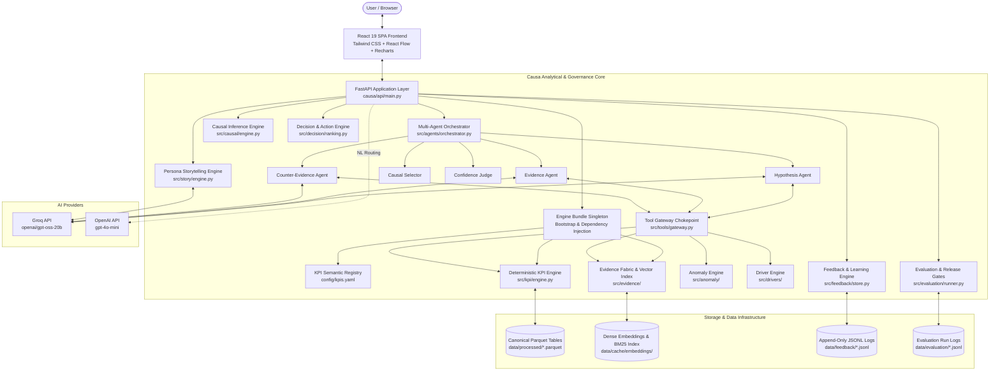
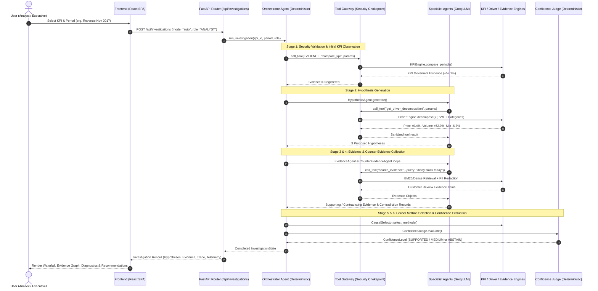
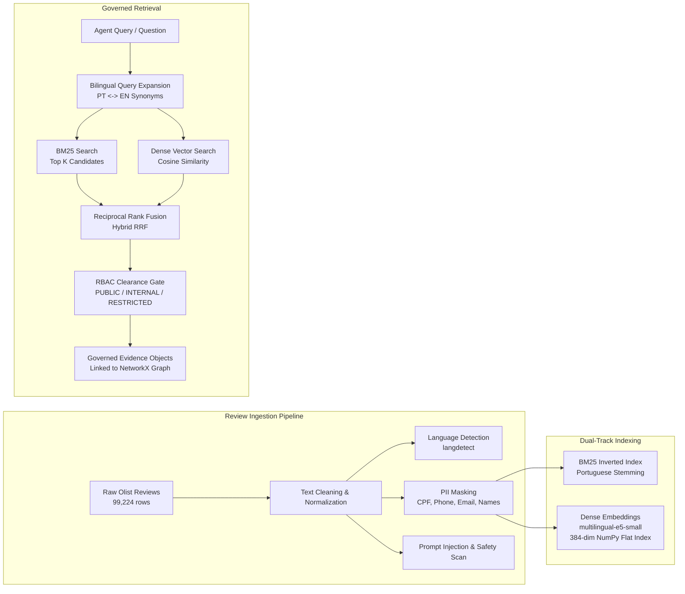
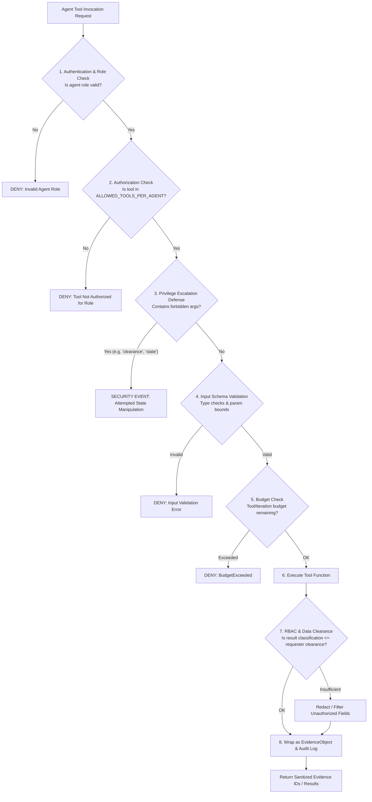

# Causa — Enterprise KPI Decision Intelligence Platform

[](https://www.python.org/)
[](https://fastapi.tiangolo.com)
[](https://react.dev/)
[](https://www.typescriptlang.org/)
[](https://vitejs.dev/)
[](https://tailwindcss.com/)
[](LICENSE)

> **Causa** is an enterprise-grade KPI Decision Intelligence platform designed to diagnose, explain, and act on business metric movements without hallucinated reasoning, ungrounded causal claims, or unverified numbers. Built on real transactional data from the [Olist Brazilian E-Commerce dataset](https://www.kaggle.com/datasets/olistbr/brazilian-ecommerce), Causa combines a deterministic analytical layer, governed semantic contracts, multi-agent orchestration, causal inference tiering, constraint-aware action generation, persona-tailored storytelling, and a non-retraining human feedback loop into a single coherent system.

---

## Table of Contents

- [Overview & Core Mission](#overview--core-mission)
- [Problem Statement & Foundational Principles](#problem-statement--foundational-principles)
- [Key Features & System Capabilities](#key-features--system-capabilities)
- [System Architecture](#system-architecture)
  - [End-to-End Information Flow](#end-to-end-information-flow)
  - [Request & Multi-Agent Lifecycle](#request--multi-agent-lifecycle)
  - [Evidence Fabric & RAG Pipeline](#evidence-fabric--rag-pipeline)
  - [Tool Gateway & Security Chokepoint](#tool-gateway--security-chokepoint)
- [Technology Stack](#technology-stack)
- [Repository Structure](#repository-structure)
- [Canonical Data Model & Anti-Fan-Out Layer](#canonical-data-model--anti-fan-out-layer)
- [KPI Semantic Layer](#kpi-semantic-layer)
- [Analytical & Diagnostic Engines](#analytical--diagnostic-engines)
  - [Deterministic KPI Computation Engine](#1-deterministic-kpi-computation-engine)
  - [Materiality & Anomaly Detection Engine](#2-materiality--anomaly-detection-engine)
  - [Driver Decomposition & Price-Volume-Mix (PVM) Engine](#3-driver-decomposition--price-volume-mix-pvm-engine)
- [Evidence Fabric & Hybrid RAG Architecture](#evidence-fabric--hybrid-rag-architecture)
- [Secure Multi-Agent Investigation Engine](#secure-multi-agent-investigation-engine)
- [Causal Analysis & Evidence Tiering Engine](#causal-analysis--evidence-tiering-engine)
- [Decision & Action Intelligence Engine](#decision--action-intelligence-engine)
- [Persona-Aware KPI Storytelling Engine](#persona-aware-kpi-storytelling-engine)
- [Human Feedback & Continuous Learning Loop](#human-feedback--continuous-learning-loop)
- [Evaluation, Benchmarks & Release Gates](#evaluation-benchmarks--release-gates)
- [Security & Governance Architecture](#security--governance-architecture)
- [Frontend Architecture & UI Overview](#frontend-architecture--ui-overview)
- [API Reference & Endpoint Catalog](#api-reference--endpoint-catalog)
- [Configuration & Environment Variables](#configuration--environment-variables)
- [Installation & Local Development](#installation--local-development)
- [Running Locally](#running-locally)
- [Testing & Validation](#testing--validation)
- [Performance & Scalability](#performance--scalability)
- [Troubleshooting & FAQ](#troubleshooting--faq)
- [Development Workflow & Code Quality](#development-workflow--code-quality)
- [Current Status & Maturity Matrix](#current-status--maturity-matrix)
- [Roadmap & Planned Extensions](#roadmap--planned-extensions)
- [License & Acknowledgements](#license--acknowledgements)

---

## Overview & Core Mission

When an executive or business analyst asks, *"Why did Revenue increase by 52.1% in November 2017 while Average Review Scores dropped by 5.2%?"*, standard enterprise tooling falls into one of two failure modes:
1. **Static BI Dashboards** show what happened across dimensions, but cannot systematically isolate mathematical drivers, assess econometric counterfactuals, search qualitative feedback, or recommend prioritized actions.
2. **Naive LLM Agents** hallucinate numbers, confuse correlation with causation, invent explanations not supported by data, bypass operational constraints, and provide generic advice such as *"improve shipping logistics"*.

**Causa** eliminates both failure modes through an epistemically strict 10-layer architecture:
- **Numbers are deterministic**: Every calculation traces back through explicit formulas to Parquet tables built from raw transaction records. LLMs never compute arithmetic.
- **Causality is governed**: Observational associations are explicitly labeled as `ASSOCIATION` or `T1/T2 Descriptive Arithmetic`. Causal claims (`T3/T4 Quasi-Experimental/Experimental`) are locked behind a 12-point econometric eligibility gate and forbidden unless formal counterfactual criteria are met.
- **Evidence is unified**: Structured metrics, mathematical decompositions, and unstructured Portuguese customer reviews (BM25 + Dense Embeddings + Bilingual Synonym Expansion) live in a single typed Evidence Graph.
- **Actions are actionable**: Recommendations emerge from a governed Decision Ontology, passing through operational constraints (budget, logistics capacity, inventory, decision rights) and ranked by mathematical priority: `Priority = (Impact × Confidence × Controllability) / Effort`.
- **Stories are verified**: Persona narratives (Executive, Finance, Operations, Marketing) are re-checked by an independent claim verifier and deterministic numeric verifier before rendering.
- **Learning never retrains models automatically**: Analyst feedback is classified, stored in append-only JSONL files, promoted to versioned evaluation cases, and enforced via runnable regression tests.

---

## Problem Statement & Foundational Principles

```
┌──────────────────────────────────────────────────────────────────────────────────────────┐
│                                CAUSA CORE INVARIANTS                                     │
├──────────────────────────┬───────────────────────────┬───────────────────────────────────┤
│ 1. Zero Numeric          │ 2. Epistemic              │ 3. Single Gateway                 │
│    Fabrication           │    Integrity              │    Chokepoint                     │
│ LLMs are NEVER the       │ Claims are strictly typed │ ALL agent tool calls pass through │
│ source of numeric truth. │ as FACT, ANALYTICAL,      │ a centralized RBAC, validation,   │
│ Every number is checked  │ ASSOCIATION, or           │ and audit gateway. No direct DB   │
│ by deterministic guards. │ HYPOTHESIS. No raw causal │ access, shell execution, or raw   │
│                          │ claims without proofs.    │ SQL is ever granted.              │
├──────────────────────────┼───────────────────────────┼───────────────────────────────────┤
│ 4. Anti-Fan-Out          │ 5. Governed Action        │ 6. Safe Learning Loop             │
│    Architecture          │    Generation             │ Feedback creates regression tests │
│ Multi-grain joins are    │ Recommendations derive    │ and versioned evaluation cases.   │
│ pre-aggregated at order  │ from ontology levers and  │ Feedback NEVER triggers automatic │
│ grain to eliminate       │ operational constraints,  │ model fine-tuning or spontaneous  │
│ payment/item duplicates. │ never generic LLM advice. │ unreviewed redeployments.         │
└──────────────────────────┴───────────────────────────┴───────────────────────────────────┘
```

### Key Architectural Standards

1. **Anti-Fan-Out Data Layer**: Naively joining `orders ⋈ order_items ⋈ order_payments ⋈ order_reviews` creates cartesian duplicates that inflate revenue by ~4.0–4.5%. Causa constructs pre-aggregated fact tables (`agg_order_items`, `agg_order_payments`, `agg_order_reviews`) at `order_id` grain.
2. **Reconciled Revenue (`CAUSA_REVENUE`)**: Formally defined as `SUM(order_items.price)` at order grain. Reconciled against `SUM(order_payments.payment_value)` with a 99.61% agreement (the 0.39% residual is isolated to financed installment interest).
3. **Data-Driven Analytical Window**: Olist transaction volume collapsed in late 2016 (329 orders) and late 2018 (20 orders in Sept–Oct 2018). Causa enforces an active analytical window of `2017-01-01` to `2018-08-31` (20 months) for all baseline evaluations.
4. **Honest Abstention Over Fabrication**: When an investigation encounters insufficient data, overlapping confounders, or missing control groups, the system explicitly returns `ABSTAINED` or `NEEDS_CLARIFICATION` rather than producing an ungrounded conclusion.

---

## Key Features & System Capabilities

### Implemented Features

- [x] **Canonical Star/Snowflake Data Layer**: 10 versioned Parquet tables in `causa/data/processed/` with strict key constraints and data lineage.
- [x] **KPI Semantic Layer**: 10 governed, machine-readable KPI contracts (`causa/config/kpis.yaml`) defining grains, formulas, dimensions, drivers, and quality bounds.
- [x] **Deterministic KPI Engine**: Vectorized computation in `src/kpi/engine.py` with AST query planning and hash-based caching.
- [x] **Materiality & Anomaly Engine**: Statistical evaluation (`src/anomaly/`) supporting Z-score, Robust Z-score (MAD), Percentile ranking, and fallback hierarchies (`entity -> category -> regional -> global`).
- [x] **Driver Decomposition Engine**: Additive Price-Volume-Mix (PVM) bridges and multi-dimensional segment attribution (`src/drivers/`) with strict reconciliation residual checks (`|residual| <= 0.01`).
- [x] **Evidence Fabric & Hybrid Retrieval**: MultiDiGraph evidence modeling (`networkx`), BM25 + Dense E5 embedding retrieval over Portuguese review texts, Portuguese-English query expansion, and PII anonymization.
- [x] **Multi-Agent Investigation Orchestration**: 6-agent system (`src/agents/`) with 100% deterministic orchestrator, hypothesis generation, evidence collection, counter-evidence validation, and confidence scoring.
- [x] **Security Tool Gateway**: Centralized tool execution chokepoint (`src/tools/gateway.py`) with role-based access control (`PUBLIC_ANALYTICAL`, `INTERNAL`, `RESTRICTED`), parameter allowlisting, and prompt injection defense.
- [x] **Causal Inference & Tiering**: 12-check eligibility gate (`src/causal/`), Difference-in-Differences (DiD), Interrupted Time Series (ITS), and anti-causal language regex guardrails.
- [x] **Decision & Action Engine**: Ontology-backed action generation (`src/decision/`), constraint evaluation (`PASS`, `WARNING`, `BLOCKED`), impact sizing, and priority scoring.
- [x] **Persona-Aware Storytelling**: Multi-stakeholder narrative synthesis (`src/story/`) for Executive, Finance, Operations, and Marketing personas with claim verification and numeric validation.
- [x] **Human Feedback & Learning**: Append-only JSONL event storage (`src/feedback/`), multi-label feedback classifier, human review gate, versioned evaluation datasets, and regression testing.
- [x] **Evaluation Framework & Release Gates**: Benchmark harness (`src/evaluation/`) covering Analytical Accuracy, RAG Quality, Agent Behavior, Recommendations, Security, and Economics.
- [x] **FastAPI REST API**: Comprehensive backend (`causa/api/`) exposing 25+ endpoints with RBAC header resolution and error translation.
- [x] **React 19 SPA Frontend**: Modern interactive dashboard (`frontend/`) with React Flow evidence graph, Recharts timeseries visualizations, interactive investigation traces, and dual-mode API switching (Live vs Offline Fixture Adapter).

### Scope Boundaries & Explicit Non-Goals

- **No Automatic Model Retraining**: Analyst feedback is converted into versioned evaluation cases and regression tests. It never triggers unsupervised model retraining or automated weight updates.
- **Observational Causal Restraint**: On the Olist dataset, Black Friday surges and observational category attributes do not meet experimental criteria. Causa intentionally scores these at `T1/T2` with `causal_claim_allowed = False`.
- **Single-Process Prototype Server**: The in-memory engine bundle is designed for single-process server execution (`uvicorn --workers 1`). Distributed multi-worker scaling requires external cache tiers (Redis).

---

## System Architecture

### End-to-End Information Flow



---

### Request & Multi-Agent Lifecycle



---

### Evidence Fabric & RAG Pipeline



---

### Tool Gateway & Security Chokepoint



---

## Technology Stack

### Frontend

| Component | Technology | Version | Purpose |
|---|---|---|---|
| **Framework** | React | `19.2.8` | Core component library & UI rendering |
| **Language** | TypeScript | `~6.0.2` | Type safety and schema synchronization |
| **Build Tool** | Vite | `^8.2.2` | Fast development server and production bundler |
| **Styling** | Tailwind CSS | `^4.3.3` | Utility-first responsive styling via `@tailwindcss/vite` |
| **CSS Utilities** | `clsx`, `tailwind-merge`, `cva` | Latest | Dynamic class generation and conflict resolution |
| **Icons** | Lucide React | `^1.35.0` | Enterprise UI iconography |
| **UI Primitives** | Radix UI | Latest | Accessible dialogs, dropdowns, tabs, and tooltips |
| **Graph Visuals** | React Flow (`reactflow`) | `^11.11.4` | Interactive Evidence Graph visualization |
| **Charts** | Recharts | `^3.10.1` | Timeseries, waterfall charts, and metric distributions |
| **State & Fetching**| React Query (`@tanstack/react-query`) | `^5.102.8` | Async server state caching and lifecycle management |
| **Routing** | React Router DOM | `^7.18.3` | Client-side routing and deep-linking |
| **Validation** | Zod | `^4.4.3` | Client-side runtime schema validation |
| **Linter** | Oxlint | `^1.79.0` | Ultra-fast JavaScript/TypeScript linting |

### Backend

| Component | Technology | Version | Purpose |
|---|---|---|---|
| **Framework** | FastAPI | `>=0.115` | High-performance async REST API framework |
| **Server** | Uvicorn (standard) | `>=0.32` | ASGI server implementation |
| **Language** | Python | `>=3.10` (tested on 3.13) | Backend runtime |
| **Data Processing** | Pandas, NumPy, PyArrow | `>=2.0`, `>=1.24`, `>=14.0` | Canonical Parquet I/O, vector algebra, data aggregations |
| **Graph Engine** | NetworkX | `>=3.2` | Directed multi-graph modeling for evidence and causal nodes |
| **Validation** | Pydantic, JSONSchema | `>=2.5`, `>=4.20` | Request/response typing and contract validation |
| **Configuration** | PyYAML | `>=6.0` | Loading YAML contracts, ontologies, and personas |
| **HTTP Client** | HTTPX | `>=0.27` | Async/sync external API communication |

### AI, ML & NLP

| Component | Technology | Source / Identifier | Purpose |
|---|---|---|---|
| **LLM Provider** | Groq API | SDK `>=0.11` | Primary low-latency LLM inference provider |
| **Primary LLM** | `openai/gpt-oss-20b` | Groq Model Hub | Multi-agent reasoning and narrative generation |
| **Question Router**| `gpt-4o-mini` | OpenAI API (fallback) | Natural language question parameter resolution |
| **Embeddings** | `sentence-transformers` | `intfloat/multilingual-e5-small` | 384-dimensional Portuguese dense review vectors |
| **Vector Engine** | Flat Cosine Index | NumPy in-memory | Vector similarity search with disk cache persistence |
| **Lexical Engine** | Okapi BM25 | Custom in-memory | Primary Portuguese text retriever with synonym expansion |
| **Language NLP** | `langdetect` | `>=1.0.9` | Language detection and filtering across review comments |

---

## Repository Structure

```text
Causa/
├── README.md                            # Comprehensive production-grade project documentation
├── causa/                               # Backend application, data pipelines, engines, and tests
│   ├── requirements.txt                 # Backend Python dependencies
│   ├── PROJECT_JOURNEY.md               # Complete chronological development log (Steps 1–9 + API)
│   ├── DATA_FOUNDATION_REPORT.md        # Step 1: Raw data integrity, schema profiling, and audit report
│   ├── REPOSITORY_AUDIT.md              # Step 1: Codebase structure, tech debt, and anti-pattern audit
│   ├── STEP2_VALIDATION.md              # Step 2: Canonical Parquet layer validation & fan-out tests
│   ├── STEP3B_VALIDATION.md             # Step 3B: Deterministic KPI engine validation
│   ├── STEP3C_VALIDATION.md             # Step 3C: Materiality & anomaly engine validation
│   ├── STEP3D_VALIDATION.md             # Step 3D: Driver decomposition & PVM bridge validation
│   ├── STEP4_VALIDATION.md              # Step 4: Evidence Fabric & graph validation
│   ├── STEP4A_VALIDATION.md             # Step 4A: Retrieval failure diagnosis & BM25 optimization
│   ├── STEP5_VALIDATION.md              # Step 5: Multi-agent investigation engine validation
│   ├── STEP6_VALIDATION.md              # Step 6: Causal analysis & evidence tiering validation
│   ├── STEP7_VALIDATION.md              # Step 7: Decision ontology & action engine validation
│   ├── STEP8_VALIDATION.md              # Step 8: Persona-aware storytelling engine validation
│   ├── STEP9_VALIDATION.md              # Step 9: Human feedback & continuous learning validation
│   │
│   ├── api/                             # FastAPI REST API layer
│   │   ├── main.py                      # FastAPI application entrypoint, CORS, and lifespan handler
│   │   ├── bootstrap.py                 # Process-lifetime EngineBundle builder (Parquet + Vector load)
│   │   ├── config.py                    # Environment settings (host, port, CORS origins)
│   │   ├── dependencies.py              # Role-to-clearance RBAC dependency resolvers
│   │   ├── errors.py                    # Global exception handlers & error message redaction
│   │   ├── kpi_support.py               # Shared baseline & anomaly computation helpers
│   │   ├── serializers.py               # Pydantic & dataclass serialization adapters
│   │   ├── store.py                     # In-memory investigation record store
│   │   └── routes/                      # Modular FastAPI route controllers
│   │       ├── health.py                # GET /api/health
│   │       ├── overview.py              # GET /api/overview
│   │       ├── kpis.py                  # GET /api/kpis, /{id}, /{id}/timeseries
│   │       ├── drivers.py               # GET /api/kpis/{id}/drivers, /pvm, /segments, /concurrent
│   │       ├── investigations.py        # POST/GET /api/investigations, /ask, /{id}/hypotheses, /process
│   │       ├── evidence.py              # GET /api/evidence, /{id}, /graph/full, /search/reviews
│   │       ├── causal.py                # GET /api/investigations/{id}/causal-analysis
│   │       ├── decisions.py             # GET /api/investigations/{id}/recommendations
│   │       ├── story.py                 # GET /api/investigations/{id}/story
│   │       ├── feedback.py              # POST/GET /api/feedback, /review, /learning/*
│   │       ├── audit.py                 # GET /api/audit, /api/investigations/{id}/audit
│   │       ├── security.py              # GET /api/security/policy, POST /rbac-demo, /prompt-injection-demo
│   │       └── telemetry.py             # GET /api/telemetry, /api/investigations/{id}/telemetry
│   │
│   ├── config/                          # Governed system configurations (YAML)
│   │   ├── kpis.yaml                    # The 10 machine-readable KPI contracts (Semantic Layer)
│   │   ├── decision_ontology.yaml       # Business ontology mapping drivers to controllable levers
│   │   ├── decision_scoring.yaml        # Scoring weights for effort, controllability, and link strength
│   │   ├── personas.yaml                # Persona storytelling rules, section orders, and focus areas
│   │   ├── storytelling.yaml            # Story generation retry limits and prompt parameters
│   │   ├── feedback.yaml                # Feedback category keywords and status promotion thresholds
│   │   ├── evaluation.yaml              # Release gate tolerances and benchmark thresholds
│   │   └── embedding.yaml               # Embedding model names, chunking, and batch configurations
│   │
│   ├── schemas/                         # Formal JSON Schemas
│   │   ├── kpi_contract.schema.json     # JSON Schema enforcing contract structure for kpis.yaml
│   │   └── decision_ontology.schema.json# JSON Schema enforcing decision ontology structure
│   │
│   ├── src/                             # Core Python analytical, AI, and causal engines
│   │   ├── kpi/                         # Deterministic KPI computation, query planner, and registry
│   │   ├── anomaly/                     # Baselines, statistical tests, and materiality decision model
│   │   ├── drivers/                     # Price-Volume-Mix decomposition & segment attribution
│   │   ├── evidence/                    # Evidence Fabric, BM25/Dense RAG, NetworkX graph, PII redaction
│   │   ├── agents/                      # 6 specialist agents, state machine, Groq LLM client, telemetry
│   │   ├── tools/                       # Tool Gateway chokepoint, RBAC policies, and tool schemas
│   │   ├── causal/                      # 12 eligibility checks, DiD/ITS estimators, causal language gate
│   │   ├── decision/                    # Decision ontology engine, constraint solver, priority ranking
│   │   ├── story/                       # Persona narratives, claim verifier, deterministic numeric verifier
│   │   ├── feedback/                    # Append-only feedback store, classifier, regression test generator
│   │   └── evaluation/                  # 6-category benchmark runner, scorecard renderer, release gate
│   │
│   ├── data/                            # Data directory
│   │   ├── raw/olist/                   # 9 raw Kaggle Olist CSV files (never modified)
│   │   ├── processed/                   # 10 canonical Parquet tables (generated by step2_04)
│   │   ├── cache/embeddings/            # Serialized dense review embeddings and metadata
│   │   └── feedback/                    # Append-only JSONL files (feedback, corrections, evaluations)
│   │
│   ├── docs/                            # 38 in-depth technical design & governance documents
│   ├── scripts/                         # Pipeline builders, validation runners, and CLI tools
│   ├── tests/                           # Complete test suite (100+ test files, 1,280+ pytest items)
│   └── reports/                         # Machine-readable validation JSON reports
│
└── frontend/                            # React 19 + TypeScript + Vite Single Page Application
    ├── package.json                     # Frontend dependencies and npm scripts
    ├── vite.config.ts                   # Vite build configuration and Tailwind integration
    ├── tsconfig.json                    # TypeScript compiler configuration
    ├── index.html                       # SPA HTML entry point
    ├── public/fixtures/                 # Offline mock JSON fixtures for demoAdapter
    └── src/
        ├── main.tsx                     # React root mount and QueryClient provider
        ├── App.tsx                      # App shell and client-side route declarations
        ├── index.css                    # Tailwind CSS imports and theme definitions
        ├── api/                         # Dual-mode API layer (Live Production API vs Demo Adapter)
        ├── components/                  # Modular React component library
        │   ├── causal/                  # Causal panels, diagnostics, abstention state views
        │   ├── common/                  # Reusable badges, cards, modals, pills, select inputs
        │   ├── confidence/              # Confidence meters and scoring breakdown cards
        │   ├── decisions/               # Recommended action cards, constraint badges, priority scores
        │   ├── drivers/                 # PVM bridge waterfall, segment breakdowns, concurrent KPIs
        │   ├── evidence/                # Evidence tables, review samples, React Flow evidence graph
        │   ├── feedback/                # Feedback submission forms, review queues, regression diffs
        │   ├── investigation/           # Hypothesis cards, investigation header, live progress panel
        │   ├── kpi/                     # KPI summary cards, timeseries charts, period pickers
        │   ├── layout/                  # Navigation header, sidebar, app shell wrapper
        │   └── security/                # RBAC matrix, prompt injection tester, tool registry table
        ├── hooks/                       # React Query hooks for each API domain
        ├── pages/                       # 9 top-level application pages
        │   ├── OverviewPage.tsx         # KPI grid, headline movement, driver waterfall
        │   ├── InvestigatePage.tsx      # Active multi-agent investigation & hypothesis drill-down
        │   ├── InvestigateHistoryPage.tsx# Past investigations catalog
        │   ├── EvidenceExplorerPage.tsx # Structured/review evidence search & graph explorer
        │   ├── DecisionsPage.tsx        # Action recommendations & constraint breakdown
        │   ├── OutcomesPage.tsx         # Feedback management, review queue & regression tests
        │   ├── SecurityPage.tsx         # Live RBAC tester & prompt injection defense demo
        │   ├── TelemetryPage.tsx        # LLM token usage, latencies, and execution costs
        │   └── LogsPage.tsx             # Structured audit trace and security event logs
        ├── state/                       # React Context (`AppStateContext.tsx`) for global UI state
        └── types/                       # Shared TypeScript domain interfaces
```

---

## Canonical Data Model & Anti-Fan-Out Layer

Causa transforms the 9 raw Olist CSV tables into a clean, typed star/snowflake schema persisted as Apache Parquet (`causa/data/processed/*.parquet`).

### The Anti-Fan-Out Problem

In e-commerce datasets, orders have a 1-to-many relationship with order items, payments, and reviews:
- `orders` (1) ↔ `order_items` ($N$)
- `orders` (1) ↔ `order_payments` ($M$)
- `orders` (1) ↔ `order_reviews` ($K$)

Joining all fact tables simultaneously before aggregating multiplies rows by $N \times M \times K$, causing massive artificial inflation of price and freight metrics.

```text
                      ┌──────────────────┐
                      │   fact_orders    │ (Grain: order_id)
                      └────────┬─────────┘
                               │
         ┌─────────────────────┼─────────────────────┐
         ▼                     ▼                     ▼
┌──────────────────┐  ┌──────────────────┐  ┌──────────────────┐
│ fact_order_items │  │  fact_payments   │  │   fact_reviews   │
│(order_id, item_id)│ │(order_id, seq_id)│  │(order_id, rev_id)│
└────────┬─────────┘  └────────┬─────────┘  └────────┬─────────┘
         │                     │                     │
         ▼                     ▼                     ▼
┌──────────────────┐  ┌──────────────────┐  ┌──────────────────┐
│ agg_order_items  │  │agg_order_payments│  │agg_order_reviews │
│(Order Grain)     │  │(Order Grain)     │  │(Order Grain)     │
└──────────────────┘  └──────────────────┘  └──────────────────┘
```

### Canonical Table Specifications

| Table Name | Grain | Row Count | Primary Key | Key Columns / Description |
|---|---|---|---|---|
| `dim_customer` | Customer | 99,441 | `customer_id` | `customer_unique_id`, `customer_city`, `customer_state`, `customer_zip_code_prefix` |
| `dim_product` | Product | 32,951 | `product_id` | `product_category_name`, `product_category_name_english`, dimensions, weight |
| `dim_seller` | Seller | 3,095 | `seller_id` | `seller_city`, `seller_state`, `seller_zip_code_prefix` |
| `fact_orders` | Order | 99,441 | `order_id` | `customer_id`, `order_status`, `order_purchase_timestamp`, `is_delivered` |
| `fact_order_items` | Item | 112,650 | `(order_id, order_item_id)` | `product_id`, `seller_id`, `shipping_limit_date`, `price`, `freight_value` |
| `fact_payments` | Payment | 103,886 | `(order_id, payment_sequential)`| `payment_type`, `payment_installments`, `payment_value` |
| `fact_reviews` | Review | 99,224 | `review_id` | `order_id`, `review_score`, `review_comment_message`, `review_creation_date` |
| `agg_order_items` | Order | 99,441 | `order_id` | `item_count`, `total_item_price`, `total_freight_value`, `distinct_products` |
| `agg_order_payments`| Order | 99,441 | `order_id` | `total_payment_value`, `installment_count`, `payment_types_list` |
| `agg_order_reviews` | Order | 99,441 | `order_id` | `avg_review_score`, `total_reviews`, `has_comment_flag` |

---

## KPI Semantic Layer

All metrics in Causa are strictly governed by machine-readable contracts in `causa/config/kpis.yaml` and validated against `causa/schemas/kpi_contract.schema.json`.

```
┌──────────────────────────────────────────────────────────────────────────────────────────┐
│                               10 GOVERNED KPI CONTRACTS                                  │
├──────────────────────┬──────────────────────┬─────────────────────┬──────────────────────┤
│ 1. revenue           │ 2. orders            │ 3. aov              │ 4. avg_delivery_days │
│ Total realized       │ Total distinct       │ Average Order Value │ Average fulfillment  │
│ merchandise value    │ completed orders     │ (Revenue / Orders)  │ duration in days     │
├──────────────────────┼──────────────────────┼─────────────────────┼──────────────────────┤
│ 5. avg_review_score  │ 6. freight_revenue   │ 7. review_volume    │ 8. on_time_delivery_ │
│ Mean customer rating │ Total shipping fees  │ Count of submitted  │    rate              │
│ (1.0 to 5.0 scale)   │ charged on orders    │ review surveys      │ % delivered on/early │
├──────────────────────┼──────────────────────┴─────────────────────┴──────────────────────┤
│ 9. quantity_sold     │ 10. repeat_purchase_rate                                          │
│ Total physical units │ Proportion of unique customers who placed 2 or more orders in     │
│ purchased            │ the historical window                                             │
└──────────────────────┴───────────────────────────────────────────────────────────────────┘
```

Every contract defines:
- `kpi_id`, `name`, `category`, and `business_purpose`
- Formal `mathematical_definition` and `underlying_tables`
- Allowed `dimensions` (e.g. `product_category`, `customer_state`, `seller_state`, `seller_id`)
- Governed `segment_clearance` (e.g. `seller_id` is restricted to `INTERNAL` clearance)
- `data_quality_rules` (null bounds, range bounds)
- `materiality_thresholds` (relative change %, absolute floor)

---

## Analytical & Diagnostic Engines

### 1. Deterministic KPI Computation Engine
Implemented in `causa/src/kpi/`:
- **Query Planner** (`query_planner.py`): Validates requested dates, grouping dimensions, and filters against the KPI contract before touching any parquet data. Rejects unauthorized or invalid dimensions upfront.
- **Computation Engine** (`engine.py`): Vectorized Pandas calculations with strict grain alignment.
- **Deterministic Cache** (`cache.py`): SHA-256 hash-keyed computation cache based on `(kpi_id, start_date, end_date, tuple(dimensions), tuple(filters))`.

### 2. Materiality & Anomaly Detection Engine
Implemented in `causa/src/anomaly/`:
- **Baseline Modeling** (`baseline.py`): Computes 10-month historical moving averages and medians. Implements a hierarchical fallback for sparse segments:
  $$\text{Entity Level} \longrightarrow \text{Category Level} \longrightarrow \text{Regional Level} \longrightarrow \text{Global Level}$$
- **Statistical Scoring** (`statistics.py`): Computes standard Z-scores, Robust Z-scores using Median Absolute Deviation (MAD), and historical empirical percentile ranks.
- **Materiality Model** (`materiality.py`): Determines whether an anomaly warrants investigation by evaluating three dimensions:
  $$\text{Investigation Trigger} = (\text{Statistical Significance}) \land (\text{Relative Magnitude} \ge \text{Threshold}) \land (\text{Absolute Impact} \ge \text{Floor})$$

### 3. Driver Decomposition & Price-Volume-Mix (PVM) Engine
Implemented in `causa/src/drivers/`:
- **PVM Bridge** (`pvm.py`): Decomposes total revenue change $\Delta R$ into Price, Volume, and Mix effects:
  $$\Delta R = \text{Price Effect} + \text{Volume Effect} + \text{Mix Effect}$$
  - $\text{Price Effect} = \sum V_1 \times (P_1 - P_0)$
  - $\text{Volume Effect} = (V_1 - V_0) \times \bar{P}_0$
  - $\text{Mix Effect} = \Delta R - (\text{Price Effect} + \text{Volume Effect})$
- **Segment Contribution** (`contribution.py`): Calculates additive contributions for categories, customer states, seller states, and individual sellers.
- **Reconciliation Guard** (`engine.py`): Asserts that sum of contributions matches total movement within R\$0.01:
  $$\left| \sum \text{Segment Contributions} - \text{Total Movement} \right| \le 0.01$$

---

## Evidence Fabric & Hybrid RAG Architecture

Implemented in `causa/src/evidence/`, the Evidence Fabric unifies structured analytical findings with unstructured customer feedback into a typed **Evidence Graph** (`networkx.MultiDiGraph`).

```
                    ┌─────────────────────────┐
                    │      EVIDENCE GRAPH     │
                    └────────────┬────────────┘
                                 │
     ┌───────────────────────────┼───────────────────────────┐
     ▼                           ▼                           ▼
┌──────────────┐         ┌───────────────┐           ┌──────────────┐
│  KPI Nodes   │◄───────►│  Driver Nodes │◄─────────►│ Review Nodes │
└──────┬───────┘         └───────┬───────┘           └──────┬───────┘
       │                         │                          │
       │    (DRIVES)             │    (EXPLAINS)            │
       └─────────────────────────┼──────────────────────────┘
                                 │
                                 ▼
                     ┌───────────────────────┐
                     │  Contradiction Edges  │ (CONTRADICTS)
                     └───────────────────────┘
```

### Retrieval Architecture & Diagnostic Findings

During Step 4A benchmarking (`scripts/step4a_retrieval_benchmark.py`), Causa identified that heavy cross-encoders and dense embeddings alone suffered on short Portuguese e-commerce texts ("ótimo produto", "entrega rápida"). 

The optimal, production-recommended retriever is **BM25 with Bilingual Query Expansion**:
- **Lexical BM25 (`bm25_retriever.py`)**: Okapi BM25 with Portuguese stemming and stopword removal ($0.9\text{ ms}$ latency, $\text{MRR} = 0.389$).
- **Bilingual Query Expansion (`language.py`)**: Governed synonym translation table mapping English terms to Portuguese customer expressions (e.g., `delay` $\rightarrow$ `atraso`, `demora`, `não recebi`).
- **Dense Retriever (`dense_retriever.py`)**: `multilingual-e5-small` 384-dimensional vector embeddings with cosine similarity.
- **Hybrid RRF (`hybrid_retriever.py`)**: Reciprocal Rank Fusion combiner ($k=60$).
- **PII & Safety Guard (`pii.py`, `safety.py`)**: Regex-based redaction of CPF numbers, phone numbers, email addresses, and names before any review text reaches an LLM prompt.

---

## Secure Multi-Agent Investigation Engine

Implemented in `causa/src/agents/`, Causa executes an end-to-end investigation through six specialized agents coordinated by a strict, finite state machine (`state_machine.py`).

```
[PLANNED]
    │
    ▼
[SECURITY_VALIDATED] ──► (Initial compare_kpi)
    │
    ▼
[HYPOTHESES_GENERATED] ──► (Hypothesis Agent proposes 2-4 candidate drivers)
    │
    ▼
[EVIDENCE_COLLECTION] ──► (Evidence Agent queries KPI, Driver, and Review tools)
    │
    ▼
[COUNTER_EVIDENCE] ──► (Counter-Evidence Agent seeks contradicting data)
    │
    ▼
[CONTRADICTION_ANALYSIS] ──► (Detects and records opposing evidence signals)
    │
    ▼
[METHOD_SELECTION] ──► (Causal Selector picks econometric method)
    │
    ▼
[CONFIDENCE_EVALUATION] ──► (Confidence Judge scores or triggers abstention)
    │
    ├─────────────────────────────┬─────────────────────────────┐
    ▼                             ▼                             ▼
[COMPLETED]                  [ABSTAINED]              [NEEDS_CLARIFICATION]
```

### Agent Roles & Specifications

| Agent Name | Engine Type | LLM Powered? | Permitted Tools | Core Responsibility |
|---|---|---|---|---|
| **Orchestrator** | Deterministic | **No** (0 LLM calls) | `None` (Delegates only) | Enforces pipeline stages, budgets, and state transitions. |
| **Hypothesis Agent** | LLM / Scripted | **Yes** (Groq) | `get_kpi`, `get_driver_decomposition`, `get_concurrent_kpis`, `search_evidence` | Proposes diverse, falsifiable hypotheses grounded in initial data. |
| **Evidence Agent** | LLM / Scripted | **Yes** (Groq) | `get_kpi`, `compare_kpi`, `get_materiality`, `get_driver_decomposition`, `search_evidence`, `get_evidence`, `get_graph_neighbors` | Executes multi-step tool loops to collect supporting data. |
| **Counter-Evidence Agent** | LLM / Scripted | **Yes** (Groq) | `search_evidence`, `get_evidence`, `get_graph_neighbors`, `get_driver_decomposition` | Actively seeks disconfirming evidence to prevent confirmation bias. |
| **Causal Selector** | Deterministic | **No** (0 LLM calls) | `get_evidence` | Inspects observational criteria and assigns appropriate causal tiers. |
| **Confidence Judge** | Deterministic | **No** (0 LLM calls) | `get_evidence` | Evaluates evidence strength; enforces **Honest Abstention** if data is weak. |

---

## Causal Analysis & Evidence Tiering Engine

Implemented in `causa/src/causal/`, this layer governs what level of causal claim the data can mathematically and statistically defend.

### The 4 Evidence Tiers

```
┌──────────────────────────────────────────────────────────────────────────────────────────┐
│                                 CAUSAL EVIDENCE TIERS                                    │
├─────────────────────────┬────────────────────────────────────────────────────────────────┤
│ T1: Descriptive Signal  │ Raw correlation, trend coincidence, or unadjusted observation. │
│                         │ Causal claims STRICTLY FORBIDDEN.                              │
├─────────────────────────┼────────────────────────────────────────────────────────────────┤
│ T2: Arithmetic Bridge   │ Mathematical decomposition (Price x Volume x Mix).             │
│                         │ Accounting identity, NOT an econometric counterfactual.        │
├─────────────────────────┼────────────────────────────────────────────────────────────────┤
│ T3: Quasi-Experimental │ Controlled methods: Difference-in-Differences (DiD),           │
│                         │ Interrupted Time Series (ITS), Synthetic Controls.             │
├─────────────────────────┼────────────────────────────────────────────────────────────────┤
│ T4: Experimental        │ Randomized Controlled Trials (A/B testing).                    │
│                         │ Gold standard causal proof.                                    │
└─────────────────────────┴────────────────────────────────────────────────────────────────┘
```

### The 12 Eligibility Checks (`eligibility.py`)

Before any quasi-experimental estimator executes, the hypothesis must clear 12 formal gates:
1. `treatment_identified`
2. `outcome_identified`
3. `treatment_precedes_outcome` (temporal precedence)
4. `sufficient_pre_period_points` ($\ge 3$ points)
5. `sufficient_post_period_points` ($\ge 1$ point)
6. `treatment_variation_exists`
7. `control_group_available` (for DiD)
8. `minimum_sample_size` ($\ge 30$ observations per group)
9. `missing_data_acceptable` ($< 20\%$ missing)
10. `confounders_assessed`
11. `stable_unit_treatment_value` (SUTVA check)
12. `consistent_grain_and_definition`

### Anti-Causal Language Guardrail (`language_gate.py`)
A strict regex guardrail scans all generated narrative and agent text. If an analysis is categorized as `T1` or `T2`, words like `"caused"`, `"drove"`, `"led to"`, or `"impact of"` are rejected and rewritten as `"associated with"`, `"coincided with"`, or `"correlated with"`.

---

## Decision & Action Intelligence Engine

Implemented in `causa/src/decision/`, this engine translates validated findings into concrete operational recommendations:

```
Driver Signal ──► Ontology Levers ──► Candidate Actions ──► Constraint Solver ──► Impact & Priority Sizing ──► Ranked Actions
```

### 1. Decision Ontology (`config/decision_ontology.yaml`)
Maps root drivers (e.g. `delivery_delay`, `aov_decline`) to controllable levers, action templates, default owners, effort tiers, and monitoring KPIs.

### 2. Constraint Engine (`constraint_engine.py`)
Evaluates candidates against 5 business constraints:
- `budget`: Financial availability (`PASS`, `WARNING`, `BLOCKED`)
- `operational_capacity`: Logistics and workforce limits
- `inventory`: Stock positioning feasibility
- `geography`: Regional carrier reach
- `decision_rights`: Owner authorization level

### 3. Impact & Priority Formula (`impact_estimator.py`, `ranking.py`)
$$\text{Expected Impact} = \text{Historical Effect Size} \times \text{Addressable Population} \times \text{Confidence Score}$$

$$\text{Priority Score} = \frac{\text{Expected Impact} \times \text{Confidence} \times \text{Controllability Tier}}{\text{Effort Tier}}$$

---

## Persona-Aware KPI Storytelling Engine

Implemented in `causa/src/story/`, this module converts trusted Evidence Packages into tailored narratives for specific stakeholders.

### Supported Personas (`config/personas.yaml`)

```
┌─────────────────┬─────────────────┬─────────────────┬─────────────────┐
│    EXECUTIVE    │     FINANCE     │   OPERATIONS    │    MARKETING    │
├─────────────────┼─────────────────┼─────────────────┼─────────────────┤
│ • Top-line ROI  │ • PVM Bridge    │ • Delivery SLAs │ • Demand trends │
│ • Major risks   │ • Margin impact │ • Carrier perf. │ • Categories    │
│ • Key actions   │ • Cost of risk  │ • Regional bottlenecks • Campaigns│
└─────────────────┴─────────────────┴─────────────────┴─────────────────┘
```

### Epistemic Claim Types & Verification
Every statement in a generated story is tagged with an epistemic claim type:
- `FACT`: Direct data retrieval (e.g. *"Revenue was R\$1,010,877"*).
- `ANALYTICAL_FINDING`: Deterministic calculation (e.g. *"Volume contributed R\$417,000"*).
- `ASSOCIATION`: Correlated movement without proven causality.
- `HYPOTHESIS`: Unproven explanatory proposition.

### Deterministic Numeric Verifier (`numeric_verifier.py`)
Before any story is returned to the user, an independent parser extracts every number, currency value, percentage, and date string from the text and matches it against the trusted `EvidencePackage`. If an LLM hallucinates an unverified number (e.g. inventing a margin figure), the story is rejected and regenerated with corrective feedback.

---

## Human Feedback & Continuous Learning Loop

Implemented in `causa/src/feedback/`, Causa learns from domain experts without automated fine-tuning.

```
Analyst Feedback ──► Multi-Label Classifier ──► Stored Correction ──► Human Review Gate ──► Evaluation Case (v1/v2) ──► Regression Tests
```

1. **Capture Layer (`capture.py`)**: Captures user ratings (`POSITIVE`, `NEGATIVE`, `INCORRECT_DRIVER`, `WRONG_RECOMMENDATION`, `HALLUCINATED_CLAIM`) and optional analyst corrections.
2. **Deterministic Classifier (`classifier.py`)**: Categorizes feedback into `DATA`, `KPI_DEFINITION`, `DRIVER`, `EVIDENCE`, `CONFIDENCE`, `RECOMMENDATION`, or `NARRATIVE`.
3. **Append-Only Event Store (`store.py`)**: Stores events immutably in `causa/data/feedback/feedback_events.jsonl`.
4. **Human Review Gate (`review.py`)**: Feedback remains `PENDING` until a human reviewer explicitly promotes it to `APPROVED_FOR_EVALUATION`.
5. **Versioned Evaluation Cases (`evaluation_case.py`)**: Mints immutable evaluation benchmarks (`expected_claims`, `forbidden_claims`).
6. **Regression Test Generator (`regression.py`)**: Automatically creates test cases that fail if an engine regression reintroduces a previously corrected error.

---

## Evaluation, Benchmarks & Release Gates

Implemented in `causa/src/evaluation/` (Step 10), Causa provides an automated evaluation harness spanning 6 critical dimensions:

```bash
python scripts/step10_evaluation.py
```

### Unified Scorecard Dimensions

| Category | Key Metrics Measured | Passing Threshold (`config/evaluation.yaml`) |
|---|---|---|
| **Analytical Quality** | KPI calculation accuracy, PVM residual reconciliation, driver ranking precision | $\text{Accuracy} \ge 95\%$, $\text{Residual} \le 0.01$ |
| **RAG & Retrieval** | MRR, Precision@K, Recall@K, Citation correctness, Evidence freshness | $\text{Recall@5} \ge 0.02$, $\text{Citation Correctness} \ge 90\%$ |
| **Agent Behavior** | Tool selection accuracy, Tool efficiency, Hallucination rate, Abstention accuracy | $\text{Hallucination Rate} \le 2\%$, $\text{Tool Accuracy} \ge 70\%$ |
| **Recommendations** | Constraint feasibility, Owner assignment correctness, Link strength | $\text{Feasibility} \ge 80\%$, $\text{Owner Correctness} \ge 90\%$ |
| **Security & Safety** | Prompt injection resistance, RBAC clearance enforcement, PII redaction | **0 critical failures tolerated** ($100\%$ pass) |
| **Economics & Latency**| P95 execution latency, token consumption, estimated USD cost per run | $\text{P95 Latency} \le 5000\text{ ms}$ |

---

## Security & Governance Architecture

```text
┌──────────────────────────────────────────────────────────────────────────────────────────┐
│                            SECURITY IN-DEPTH LAYERS                                      │
├──────────────────────────┬───────────────────────────┬───────────────────────────────────┤
│ 1. Tool Gateway RBAC     │ 2. Prompt Injection       │ 3. PII Anonymization             │
│ Tools and data fields are│ Untrusted review text is  │ CPF tax IDs, phone numbers,       │
│ filtered by requester    │ wrapped in strict data    │ and email addresses are masked    │
│ clearance: PUBLIC,       │ boundaries:               │ before indexing or LLM ingestion. │
│ INTERNAL, RESTRICTED.    │ <untrusted_evidence>...   │                                   │
├──────────────────────────┼───────────────────────────┼───────────────────────────────────┤
│ 4. No Raw SQL / Shell    │ 5. Numeric Guardrails     │ 6. Anti-Causal Language           │
│ Agents have zero access  │ Generated story numbers   │ Observational claims are          │
│ to arbitrary SQL, code   │ are verified against the  │ restricted to non-causal verbs    │
│ execution, or shell.     │ trusted Evidence Package. │ via regex gate enforcement.       │
└──────────────────────────┴───────────────────────────┴───────────────────────────────────┘
```

### RBAC Clearance Hierarchy (`src/tools/policy.py`)

$$\text{PUBLIC\_ANALYTICAL} \subset \text{INTERNAL} \subset \text{RESTRICTED}$$

- **`EXECUTIVE` Role**: Maps to `PUBLIC_ANALYTICAL`. Can see aggregated metrics and category-level drivers. Seller IDs and individual customer details are redacted.
- **`ANALYST` Role**: Maps to `INTERNAL`. Can access seller-level breakdowns, carrier performance, and operational logs.
- **`INTERNAL` Role**: Maps to `RESTRICTED`. Full access for compliance audits.

---

## Frontend Architecture & UI Overview

The frontend is a React 19 Single Page Application located in `frontend/`.

```
frontend/src/
├── api/                     # API client layer
│   ├── index.ts             # Runtime dispatcher (routes calls to prod or demo adapter)
│   ├── mode.ts              # Live vs Demo mode state management
│   ├── productionApi/       # Live HTTP client calling FastAPI backend (localhost:8000)
│   └── demoAdapter/         # Offline mock fixture loader (reads public/fixtures/)
├── pages/                   # Top-level view controllers
│   ├── OverviewPage.tsx     # KPI Scorecards, Headline Anomaly, Driver Waterfall
│   ├── InvestigatePage.tsx  # Multi-Agent Active Investigation, Hypotheses, Trace
│   ├── EvidenceExplorerPage.tsx # Review search, filters, and React Flow Evidence Graph
│   ├── DecisionsPage.tsx    # Ranked recommendations, constraint checks, and levers
│   ├── OutcomesPage.tsx     # Analyst feedback review queue and regression test suite
│   ├── SecurityPage.tsx     # Interactive RBAC tester & Prompt Injection benchmark
│   ├── TelemetryPage.tsx    # LLM token telemetry, latencies, and dollar cost breakdown
│   └── LogsPage.tsx         # Structured audit traces and security events
├── components/              # Modular component tree
└── state/                   # AppStateContext (active period, role, API mode, modals)
```

### Dual-Mode API Client (`frontend/src/api/index.ts`)

The frontend can operate in two distinct modes without code modifications:
1. **Live Mode (`productionApi`)**: Dispatches real HTTP requests to the FastAPI backend at `http://localhost:8000`.
2. **Demo Mode (`demoAdapter`)**: Fully offline fallback serving static JSON fixtures from `public/fixtures/`. Ideal for static demonstrations or evaluating UI components without running the Python backend.

---

## API Reference & Endpoint Catalog

The FastAPI backend exposes the following REST endpoints:

### System & Overview
- `GET /api/health` — Backend health and EngineBundle readiness status.
- `GET /api/overview` — Aggregated KPI movements, headline anomaly verdict, and driver decomposition.

### KPIs & Metrics
- `GET /api/kpis` — List all governed KPI movements for a given period pair.
- `GET /api/kpis/{kpi_id}` — Get single KPI movement and metadata.
- `GET /api/kpis/{kpi_id}/timeseries` — Get monthly timeseries data points for charting.

### Driver Decompositions
- `GET /api/kpis/{kpi_id}/drivers` — Full Price-Volume-Mix decomposition and ranked segment contributions.
- `GET /api/kpis/{kpi_id}/pvm` — Isolated Price, Volume, and Mix waterfall numbers.
- `GET /api/kpis/{kpi_id}/segments` — Segment contribution breakdowns (e.g. by `product_category`).
- `GET /api/kpis/{kpi_id}/concurrent` — Concurrent movements in other KPIs during the same timeframe.

### Investigations & Multi-Agent Orchestration
- `POST /api/investigations` — Launch or replay an investigation (`kpi_id`, `period_current`, `period_previous`, `mode="auto"|"live"|"fresh"`).
- `POST /api/investigations/ask` — Natural language question endpoint; resolves question to governed parameters and runs investigation.
- `GET /api/investigations` — List past investigation records.
- `GET /api/investigations/{id}` — Retrieve full investigation state, hypotheses, and evidence IDs.
- `GET /api/investigations/{id}/hypotheses` — Get detailed hypothesis evaluations and support statuses.
- `GET /api/investigations/{id}/process` — Get investigation execution audit trace and status history.
- `GET /api/investigations/{id}/causal-analysis` — Get causal eligibility checks and econometric results.
- `GET /api/investigations/{id}/recommendations` — Get ontology-derived recommendations and constraint evaluations.
- `GET /api/investigations/{id}/story?persona={EXECUTIVE|FINANCE|OPERATIONS|MARKETING}` — Generate verified persona narrative.

### Evidence & Review Search
- `GET /api/evidence` — List filtered evidence objects by type.
- `GET /api/evidence/{id}` — Fetch full detail of a specific evidence object (RBAC enforced).
- `GET /api/evidence/graph/full` — Fetch complete nodes and edges for the Evidence Graph.
- `GET /api/evidence/search/reviews` — Execute hybrid BM25/Dense search over Portuguese customer reviews.
- `GET /api/evidence/contradictions/checks` — List all detected contradiction edges in the Evidence Graph.

### Feedback, Governance & Learning
- `POST /api/feedback` — Submit analyst feedback on claims or recommendations.
- `GET /api/feedback` — List stored feedback records with status filters.
- `GET /api/feedback/{id}` — Retrieve feedback detail and associated corrections.
- `POST /api/feedback/{id}/review` — Human review gate: accept, contest, or approve feedback for evaluation.
- `GET /api/learning/evaluation-cases` — List versioned evaluation benchmark cases.
- `GET /api/learning/regressions` — List generated regression test definitions.
- `GET /api/learning/evaluations` — On-demand offline evaluation status.

### Security, Audit & Telemetry
- `GET /api/security/policy` — Active RBAC matrices, clearance hierarchies, and tool registries.
- `POST /api/security/rbac-demo` — Test RBAC clearance sufficiency for a role and data classification.
- `POST /api/security/prompt-injection-demo` — Test untrusted evidence sanitization wrapping.
- `GET /api/audit` — Global structured tool execution and security audit logs.
- `GET /api/investigations/{id}/audit` — Investigation-specific audit trace and security events.
- `GET /api/telemetry` — Global LLM token usage, latencies, and dollar cost summaries.
- `GET /api/investigations/{id}/telemetry` — Run-specific LLM telemetry and execution metrics.

---

## Configuration & Environment Variables

### Environment Variables

Create `.env` files in `causa/` and `frontend/` as needed:

#### Backend Configuration (`causa/.env`)

| Variable | Type | Default | Required? | Purpose |
|---|---|---|---|---|
| `GROQ_API_KEYS` | String (CSV) | `""` | Optional | Comma-separated Groq API keys for `mode=live` multi-agent runs. |
| `GROQ_MODEL` | String | `openai/gpt-oss-20b` | Optional | Groq model identifier for agent and storytelling completions. |
| `OPENAI_API_KEY` | String | `""` | Optional | OpenAI key for natural language question router (`/api/investigations/ask`). Falls back to keyword router if absent. |
| `OPENAI_QUESTION_ROUTER_MODEL` | String | `gpt-4o-mini` | Optional | Model identifier for OpenAI question resolution. |
| `CAUSA_API_HOST` | String | `0.0.0.0` | Optional | IP address for FastAPI backend server to bind to. |
| `CAUSA_API_PORT` | Integer | `8000` | Optional | Port for FastAPI backend server. |
| `CAUSA_CORS_ORIGINS` | String (CSV) | `http://localhost:5173,http://127.0.0.1:5173` | Optional | Allowed CORS origins for web client access. |
| `HF_TOKEN` | String | `""` | Optional | Hugging Face token (used only for extended offline retrieval benchmarks). |

#### Frontend Configuration (`frontend/.env`)

| Variable | Type | Default | Required? | Purpose |
|---|---|---|---|---|
| `VITE_API_BASE_URL` | String | `http://localhost:8000` | Optional | Base URL of the running FastAPI backend. |

---

## Installation & Local Development

### Prerequisites

- **Python**: `>= 3.10` (Python 3.11, 3.12, or 3.13 recommended)
- **Node.js**: `>= 18.0.0` (Node 20+ recommended)
- **npm**: `>= 9.0.0`
- **Git**: `>= 2.30`

---

### Step 1: Clone Repository & Setup Backend

```bash
# Clone repository
git clone https://github.com/a-kakade/Causa.git
cd Causa/causa

# Create and activate Python virtual environment
python -m venv .venv
# On Linux/macOS:
source .venv/bin/activate
# On Windows (PowerShell):
.venv\Scripts\Activate.ps1
# On Windows (CMD):
.venv\Scripts\activate.bat

# Install Python dependencies
pip install -r requirements.txt
```

---

### Step 2: Download Raw Dataset & Build Canonical Layer

1. Download the [Kaggle Olist Brazilian E-Commerce Dataset](https://www.kaggle.com/datasets/olistbr/brazilian-ecommerce).
2. Extract the CSV files directly into `causa/data/raw/olist/`. Expected files:
   - `olist_customers_dataset.csv`
   - `olist_orders_dataset.csv`
   - `olist_order_items_dataset.csv`
   - `olist_order_payments_dataset.csv`
   - `olist_order_reviews_dataset.csv`
   - `olist_products_dataset.csv`
   - `olist_sellers_dataset.csv`
   - `olist_geolocation_dataset.csv`
   - `product_category_name_translation.csv`

3. Build the canonical Parquet data layer:
```bash
python scripts/step2_04_build_canonical.py
```
*This generates the 10 canonical Parquet tables in `causa/data/processed/` with strict key verification and pre-aggregated anti-fan-out facts.*

---

### Step 3: Setup Frontend

```bash
cd ../frontend

# Install Node dependencies
npm install
```

---

## Running Locally

To run the complete Causa application locally, start the backend and frontend in separate terminals:

### Terminal 1: Start FastAPI Backend

```bash
cd causa
# Ensure virtual environment is active
uvicorn api.main:app --host 0.0.0.0 --port 8000 --reload
```
> **Note on Startup**: On initial startup, the backend builds the shared `EngineBundle` (loading Parquet tables, initializing the Semantic Registry, and compiling the review BM25/vector indices), which takes approximately 60–90 seconds. Once initialized, subsequent API requests execute with sub-second latencies.

### Terminal 2: Start React Frontend

```bash
cd frontend
npm run dev
```

Open your browser and navigate to:
```text
http://localhost:5173
```

---

## Testing & Validation

Causa maintains a comprehensive test suite of **over 1,280 automated tests** covering all analytical formulas, security policies, causal estimators, multi-agent loops, and evaluation gates.

### Running Backend Tests

```bash
cd causa

# Run the complete test suite
pytest

# Run specific domain test suites
pytest tests/test_kpi_engine.py           # Deterministic KPI arithmetic
pytest tests/test_anomaly_engine.py       # Materiality & anomaly detection
pytest tests/test_driver_engine.py        # PVM & driver decompositions
pytest tests/test_tool_gateway.py         # Security gateway & RBAC checks
pytest tests/test_orchestrator.py         # Multi-agent state machine & budgets
pytest tests/test_causal_gate.py          # 12-point causal eligibility checks
pytest tests/test_decision_end_to_end.py  # Decision ontology & action ranking
pytest tests/test_numeric_verifier.py     # Story numeric hallucination guards
pytest tests/test_feedback_safety.py      # Non-retraining feedback safety invariants
pytest tests/test_api_*.py                # FastAPI REST route tests
```

### Running Evaluation Benchmarks (Step 10)

```bash
cd causa

# Run full unified evaluation scorecard
python scripts/step10_evaluation.py

# Run specific evaluation categories
python scripts/step10_evaluation.py --category analytical --category security
```

### Running Frontend Checks

```bash
cd frontend

# Run Oxlint linter
npm run lint

# Run TypeScript type check and production bundle build
npm run build
```

---

## Performance & Scalability

### Architectural Performance Characteristics

- **Zero-Network Default Tests**: $\sim 90\%$ of the multi-agent test suite executes against deterministic `FakeLLMClient` fixtures, enabling fast, reproducible CI test execution without incurring API costs.
- **Fast BM25 Retrieval**: Review search achieves $0.9–1.0\text{ ms}$ query latency with $< 1\text{ MB}$ memory overhead for BM25 with bilingual synonym expansion, outperforming heavy dense cross-encoders ($450–500\text{ ms}$) on the target Portuguese corpus.
- **Single-Process Prototype Invariant**: The backend maintains a process-lifetime singleton `EngineBundle` in memory. This is optimal for single-process prototype deployments (`uvicorn --workers 1`). Running across multiple worker processes requires an external shared cache (e.g. Redis).
- **Synchronous Atomic Investigations**: The orchestrator executes the 9-stage investigation pipeline atomically. `/api/investigations/{id}/process` reconstructs the completed run's audit trace and status history.

---

## Troubleshooting & FAQ

### 1. Backend Fails to Start (`Missing canonical table(s)`)
- **Cause**: `causa/data/processed/*.parquet` files have not been generated yet.
- **Fix**: Run `python scripts/step2_04_build_canonical.py` from the `causa/` directory. Ensure raw CSV files exist in `causa/data/raw/olist/`.

### 2. Live Investigation Fails with `mode=live requested but no GROQ_API_KEYS are configured`
- **Cause**: The backend was triggered with `mode=live` without API credentials.
- **Fix**: Add valid Groq API key(s) to `causa/.env` as `GROQ_API_KEYS=gsk_...`. Alternatively, use `mode="auto"` (default), which replays the validated November 2017 investigation report without spending API credits.

### 3. Investigation Returns `ABSTAINED`
- **Explanation**: This is an intentional feature, not a bug. In observational datasets like Olist, when evidence is confounded (e.g. Black Friday volume surges overlapping with shipping delays) or sample sizes are insufficient, Causa's Confidence Judge honestly abstains rather than inventing an ungrounded explanation.

### 4. Frontend Shows "Demo Mode" Banner
- **Explanation**: If the FastAPI backend is not reachable at `http://localhost:8000`, the frontend automatically falls back to `demoAdapter` to serve static fixtures. Start the backend with `uvicorn api.main:app --port 8000` to connect live.

---

## Development Workflow & Code Quality

- **Branching Strategy**: Feature branches off `main` with explicit validation docs (`STEPX_VALIDATION.md`).
- **Deterministic Math Rule**: Never write arithmetic in prompts or LLM loops. All calculations belong in `src/kpi/`, `src/anomaly/`, or `src/drivers/`.
- **AST Scan Enforcement**: AST safety tests (`tests/test_orchestrator.py`, `tests/test_feedback_safety.py`) scan the codebase to guarantee that Orchestrator modules never import evidence schemas directly and feedback modules never import training or fine-tuning libraries.

---

## Current Status & Maturity Matrix

| Subsystem | Implementation Status | Test Coverage | Documentation |
|---|---|---|---|
| **Data Foundation & Canonical Model** | ✅ Production Ready | 62 tests | `DATA_FOUNDATION_REPORT.md`, `STEP2_VALIDATION.md` |
| **KPI Semantic Layer (3A)** | ✅ Governed (10 KPIs) | 35 tests | `docs/KPI_SEMANTIC_LAYER.md` |
| **KPI Computation Engine (3B)** | ✅ Production Ready | 48 tests | `STEP3B_VALIDATION.md`, `docs/KPI_COMPUTATION_ENGINE.md` |
| **Materiality & Anomaly Engine (3C)** | ✅ Production Ready | 52 tests | `STEP3C_VALIDATION.md`, `docs/MATERIALITY_ENGINE.md` |
| **Driver Decomposition Engine (3D)** | ✅ Production Ready | 65 tests | `STEP3D_VALIDATION.md`, `docs/DRIVER_DECOMPOSITION.md` |
| **Evidence Fabric & Hybrid RAG (4/4A)** | ✅ Optimized (BM25+Dense)| 78 tests | `STEP4_VALIDATION.md`, `STEP4A_VALIDATION.md` |
| **Multi-Agent Orchestration (5)** | ✅ Production Ready | 139 tests | `STEP5_VALIDATION.md`, `docs/MULTI_AGENT_ARCHITECTURE.md` |
| **Causal Inference Engine (6)** | ✅ Governed (T1–T4) | 72 tests | `STEP6_VALIDATION.md`, `docs/CAUSAL_ARCHITECTURE.md` |
| **Decision & Action Engine (7)** | ✅ Ontology-backed | 113 tests | `STEP7_VALIDATION.md`, `docs/DECISION_ARCHITECTURE.md` |
| **Persona Storytelling Engine (8)** | ✅ Verifier-guarded | 105 tests | `STEP8_VALIDATION.md`, `docs/STORYTELLING_ARCHITECTURE.md` |
| **Human Feedback & Learning (9)** | ✅ Non-retraining loop | 93 tests | `STEP9_VALIDATION.md`, `docs/FEEDBACK_ARCHITECTURE.md` |
| **Evaluation & Release Gates (10)** | ✅ Complete (6 dims) | 88 tests | `docs/EVALUATION_GOVERNANCE.md` |
| **FastAPI REST Layer** | ✅ Production Ready (25+ eps)| 28 tests | `docs/API_ARCHITECTURE.md` |
| **React 19 Frontend SPA** | ✅ Production Ready | Typechecked & Linted | `docs/FRONTEND_BACKEND_INTEGRATION.md` |

---

## Roadmap & Planned Extensions

- [ ] **Asynchronous Background Task Queue**: Transition long-running `mode=live` multi-agent runs from synchronous HTTP requests to Celery/Redis worker queues with SSE (Server-Sent Events) live streaming.
- [ ] **Distributed Multi-Process Cache**: Migrate in-memory `EngineBundle` and computation caches to Redis/Memcached to support multi-worker Uvicorn and Kubernetes deployments.
- [ ] **Expanded Decision Ontologies**: Broaden `config/decision_ontology.yaml` to include inventory reordering, marketing spend reallocation, and regional seller incentive levers.
- [ ] **Automated Offline Evaluation History Persistence**: Persist historical Step 10 evaluation runs into a queryable SQLite/PostgreSQL store for longitudinal model regression tracking.

---

## License & Acknowledgements

- **Dataset**: Brazilian E-Commerce Public Dataset by [Olist](https://www.kaggle.com/datasets/olistbr/brazilian-ecommerce), released under CC BY-NC-SA 4.0.
- **License**: This project is licensed under the [MIT License](LICENSE).
